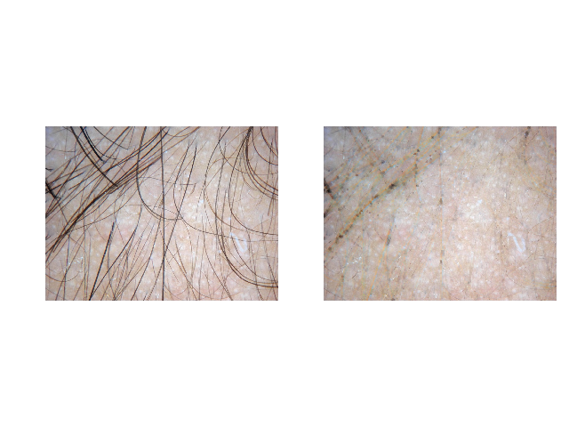

# Hair Removal in Dermoscopic Images with Soft Color Morphology

Algorithm to remove hair in dermoscopic images, based on the top hat operation with a bank of oriented bar-like structuring elements.
Inpainting achieved by iteratively recovering missing colors with two morphological operations: opening and closing.

```
Bibiloni, P., González-Hidalgo, M., & Massanet, S. (2017, June). 
Skin hair removal in dermoscopic images using soft color morphology. 
Conference on Artificial Intelligence in Medicine in Europe (pp. 322-326). Springer, Cham.
```




## Getting Started

You may download from the repository, or just install through pip:
```bash
pip install git+https://github.com/pbibiloni/hair-removal.git
```

Then, simply use it as a normal import (it can take a while):
```
import logging
from hair_removal import remove_and_inpaint

logging.basicConfig(stream=sys.stdout, level=logging.INFO)  # Show logs
hairless_image, steps = remove_and_inpaint(dermoscopic_image_as_rgb)
```

It can also be customized to, for instance, be used with images of different size:
```
import logging
import numpy as np
from hair_removal import bank_of_structuring_elements, remove_and_inpaint

logging.basicConfig(stream=sys.stdout, level=logging.INFO)  # Show logs
tophats_se = bank_of_structuring_elements(side_enclosing_square_in_px=9, num_orientations=3)
inpainting_se = np.ones((3, 3), dtype='float32')
hairless_image, steps = remove_and_inpaint(dermoscopic_image_as_rgb, tophats_se=tophats_se, inpainting_se=inpainting_se)
```


### More examples

Browse the [examples folder](examples) to check out a more complete example.


## License

This project is licensed under the MIT License - see the [LICENSE](LICENSE) file for details.

Copyright (c) 2019 Pedro Bibiloni [http://pedro.bibiloni.es] [pedro@bibiloni.es], SCOPIA Research group [http://scopia.uib.es], Universitat de les Illes Balears [http://uib.es].

